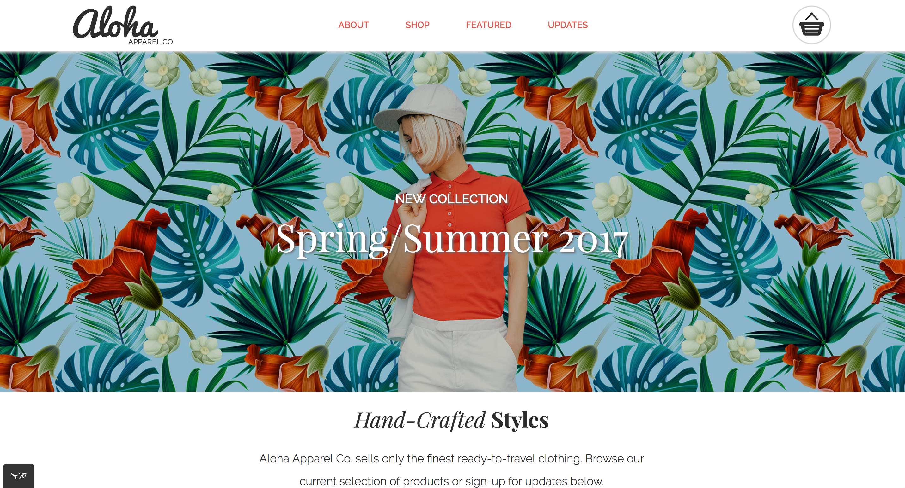

Aloha Apparel website depicts the homescreen of Aloha Apparel Company. It is built with a responsive design that works for desktop, tablet, and mobile.

# Motivation
Aloha Apparel was created as a step one deliverable for a project at RED Academy. 

# Key Takeaways
The main motivation behind the creation of this website was to become more familiar and comfortable with html and css, as well as responsive web design, and using git & github. These goals were achieved through the creation of Aloha. As can be seen through out the code, many different techniques, properties, and organizations were used.

# Included
index.html
style.css
*this* README.md
.gitignore
all font resources
all images used

# Technologies Used
The site was designed using Visual Studio Code. Many references were made to Mozilla Developer Network, Stack Overflow, RED resources, and others. 

# Organization
The style.css file is organized to reflect the flow of the index.html file, it is arranged in chronological order (generally) and commented to aid in readability.

# Installation
No installation required.

# Contributors
Montana Sawyer
